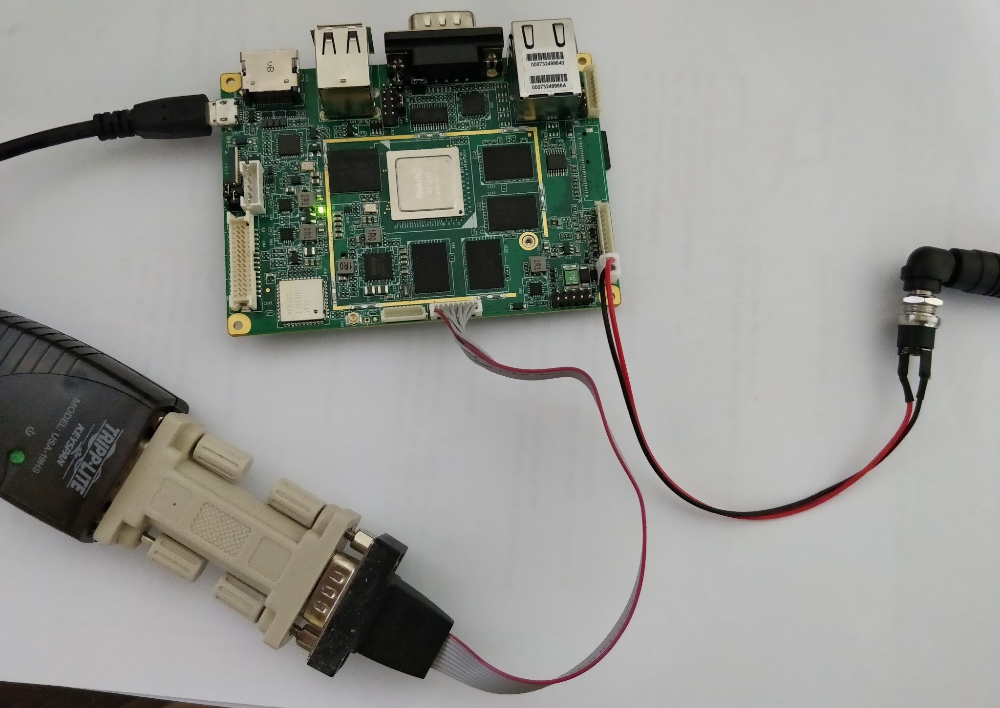

Vyasa RK3288 Mainline Linux BSP Guide
=====================================

This tutorial will show the details of Vyasa RK3288 Linux BSP Guide. Most of the software supported by Vyasa is mainlined already.

Hardware Access

Serial: NULL Modem cable, Serial-to-USB converter

Power: DC-in 12V ~ 24V socket supply

Sometimes junk characters show on serial console so better to plug-in USB OTG cable

Prebuilt Image
Insert the SD card on to host and write the image.

::

        $ git clone https://github.com/openedev/rootfs-rk32
        $ cd rootfs-rk32/boot
        $ xzcat sdcard-vyasa.img.xz | dd of=/dev/mmcblk0
        $ sync
        $ umount /dev/mmcblk0*

Turn-on the board

BSP Building
Image building need host to ready with all necessary tools ready, refer here

U-Boot

::

        $ git clone git://git.denx.de/u-boot.git
        $ cd u-boot
        $ make vyasa-rk3288_defconfig
        $ make 

Linux

::

        $ git clone git://git.kernel.org/pub/scm/linux/kernel/git/next/linux-next.git
        $ cd linux-next
        $ make mrproper
        $ ARCH=arm make multi_v7_defconfig
        $ ARCH=arm make menuconfig
        [select CONFIG_DWMAC_ROCKCHIP=m]
        $ ARCH=arm make -j 4 LOADADDR=0x02000000 uImage dtbs
        $ ARCH=arm make modules -j 4

        #modules would installed in lib/ directory of kernel source
        $ ARCH=arm make modules_install -j 4 INSTALL_MOD_PATH=./

        #for linux-next kernel repo
        $ find . -name *`cat localversion-next`

Rootfs
Buildroot
It's easy to build entire system using buildroot and mainline supported Vyasa board already. See read this readme.txt for more info.

::

        $ git clone git://git.busybox.net/buildroot
        $ cd buildroot
        $ make amarula_vyasa_rk3288_defconfig && make

Prepare your SDCard:

Buildroot generates a ready-to-use SD card image that you can flash directly to the card. The image will be in output/images/sdcard.img. You can write this image directly to an SD card device (i.e. /dev/xxx)

::

        $ sudo dd if=output/images/sdcard.img of=/dev/xxx
        $ sudo sync

Finally, you can insert the SD card to the Vyasa RK3288 board, close J4 and boot it.
        
Ubuntu 16.04
U-Boot/Linux
Build U-Boot. Linux from BSP Build and Build Mali

Ubuntu RFS
ubuntu-xenial

::

        $ cd /path/to
        $ wget http://cdimage.ubuntu.com/ubuntu-base/releases/16.04/release/ubuntu-base-16.04-core-armhf.tar.gz
        $ mkdir /path/to/ubuntu
        $ cd ubuntu
        $ tar xvf ../ubuntu-base-16.04-core-armhf.tar.gz

copy qemu

::

        $ apt-get install qemu-user-static
        $ cp /usr/bin/qemu-arm-static usr/bin/
        
copy host's dns

::

        $ cp -b /etc/resolv.conf  etc/resolv.conf
        
add the following repository to etc/apt/sources.list(for compiling xserver)

::

        # See http://help.ubuntu.com/community/UpgradeNotes for how to upgrade to
        # newer versions of the distribution.
        deb http://ports.ubuntu.com/ubuntu-ports/ xenial main  restricted
        deb-src http://ports.ubuntu.com/ubuntu-ports/ xenial main restricted

        ## Major bug fix updates produced after the final release of the
        ## distribution.
        deb http://ports.ubuntu.com/ubuntu-ports/ xenial-updates main restricted
        deb-src http://ports.ubuntu.com/ubuntu-ports/ xenial-updates main restricted

        ## Uncomment the following two lines to add software from the 'universe'
        ## repository.
        ## N.B. software from this repository is ENTIRELY UNSUPPORTED by the Ubuntu
        ## team. Also, please note that software in universe WILL NOT receive any
        ## review or updates from the Ubuntu security team.
        deb http://ports.ubuntu.com/ubuntu-ports/ xenial universe
        deb-src http://ports.ubuntu.com/ubuntu-ports/ xenial universe
        deb http://ports.ubuntu.com/ubuntu-ports/ xenial-updates universe
        deb-src http://ports.ubuntu.com/ubuntu-ports/ xenial-updates universe

        ## N.B. software from this repository may not have been tested as
        ## extensively as that contained in the main release, although it includes
        ## newer versions of some applications which may provide useful features.
        ## Also, please note that software in backports WILL NOT receive any review
        ## or updates from the Ubuntu security team.
        deb http://ports.ubuntu.com/ubuntu-ports/ xenial-backports main restricted
        deb-src http://ports.ubuntu.com/ubuntu-ports/ xenial-backports main restricted

        deb http://ports.ubuntu.com/ubuntu-ports/ xenial-security main restricted
        deb-src http://ports.ubuntu.com/ubuntu-ports/ xenial-security main restricted
        #deb http://ports.ubuntu.com/ubuntu-ports/ xenial-security universe
        #deb-src http://ports.ubuntu.com/ubuntu-ports/ xenial-security universe
        #deb http://ports.ubuntu.com/ubuntu-ports/ xenial-security multiverse
        #deb-src http://ports.ubuntu.com/ubuntu-ports/ xenial-security multiverse

        deb http://ports.ubuntu.com/ubuntu-ports/ xenial-proposed main restricted
        deb-src http://ports.ubuntu.com/ubuntu-ports/ xenial-proposed main restricted

chroot to RFS

Download ch-mount 
ch-mount.sh

::

        $ cd ../
        $ ch-mount.sh -m ubuntu/ 

Install desktop

::

        $ apt-get update
        $ apt-get install lightdm vim git
        $ apt-get build-dep xserver-xorg-core

Build xserver

::

        $ cd /opt
        $ git clone git://anongit.freedesktop.org/xorg/lib/libXfont
        $ cd libXfont
        $ ./autogen.sh --prefix=/usr
        $ make check
        $ make && make install
        $ cd ..
        $ apt install libxcb-xkb-dev
        $ git clone https://github.com/rockchip-linux/xserver.git
        $ cd xserver
        [ delete these line on configure.ac ]
        AC_CHECK_DECL(GBM_BO_USE_LINEAR,
                                [AC_DEFINE(GLAMOR_HAS_GBM_LINEAR, 1, [Have GBM_BO_USE_LINEAR])], []
        $ ./autogen.sh --prefix=/usr --enable-aiglx --enable-composite --enable-record --enable-xv --enable-xvmc \
        --enable-dga --enable-screensaver \--enable-xdmcp --enable-xdm-auth-1 --enable-glx --enable-dri --enable-dri2 \
         --enable-glamor --enable-dri3 --enable-libdrm --enable-present --enable-xinerama --enable-xf86vidmode \
        --enable-xace --enable-xselinux --enable-xfree86-utils --enable-systemd-logind --with-systemd-daemon \
        --enable-suid-wrapper --enable-dmx --enable-xvfb --enable-xnest --enable-kdrive --enable-xephyr --enable-xmir \
        --with-sha1=libgcrypt --enable-xcsecurity --with-log-dir=/var/log
        $ make && make install
        
set password

::

        $ useradd -s '/bin/bash' -m -G adm,sudo rk
        $ echo "Set password for rk:"
        $ passwd rk
        $ echo "Set password for root:"
        $ passwd root
        
exit chroot

::

        $ exit
        $ ch-mount.sh -u ubuntu/
        
libmali

Copy libmali here to ubuntu/opt

Prepare SD
Create Single partition and Insert the SD on host.

::

        $ cp ubuntu/* /media/jagan/rootfs
        $ cp path/to/arch/arm/boot/uImage /media/jagan/rootfs/boot
        $ cp /path/to/rockchip_forwardports/midgard_r13p0/mali_kbase.ko /media/jagan/root
        $ cp path/to/arch/arm/boot/dts/rk3288-vyasa.dtb /media/jagan/rootfs/boot
        $ mkdir /media/jagan/rootfs/boot/extlinux/
        $ vi /media/jagan/rootfs/boot/extlinux/extlinux.conf
        label Vyasa linux-next
          kernel /boot/uImage
          devicetree /boot/rk3288-vyasa.dtb
          append console=ttyS2,115200n8 root=/dev/mmcblk0p1 rootwait
        $ cd /path/to/u-boot
        $ ./tools/mkimage -n rk3288 -T rksd -d ./tpl/u-boot-tpl.bin out
        $ cat ./spl/u-boot-spl-dtb.bin >> out
        $ dd if=out of=/dev/mmcblk0 seek=64
        $ dd if=u-boot-dtb.img of=/dev/mmcblk0 seek=16384
        $ sync && sudo umount /media/jagan/rootfs
        
Boot Ubuntu

Insert the SD card put SD Bootmode and power-on the board

We need insert mali drivers and libs

::

        root@localhost:/opt/libmali# cat /sys/devices/platform/*gpu/gpuinfo
        Mali-T76x MP4 r0p0 0x0750
        root@localhost:/opt/libmali# mount -n -oremount,rw /
        root@lalhost:/opt/libmali# dpkg -i libmali-rk-midgard-t76x-r14p0-r0p0_1.5-6_arm
        Selecting previously unselected package libmali-rk-midgard-t76x-r14p0-r0p0:armhf.
        (Reading database ... 62913 files and directories currently installed.)
        Preparing to unpack libmali-rk-midgard-t76x-r14p0-r0p0_1.5-6_armhf.deb ...
        Unpacking libmali-rk-midgard-t76x-r14p0-r0p0:armhf (1.5-6) ...
        Replacing files in old package libgbm1:armhf (17.2.4-0ubuntu1~16.04.2) ...
        Setting up libmali-rk-midgard-t76x-r14p0-r0p0:armhf (1.5-6) ...
        root@localhost:/opt/libmali# dpkg -i libmali-rk-dev_1.5-6_armhf.deb 
        Selecting previously unselected package libmali-rk-dev:armhf.
        (Reading database ... 62927 files and directories currently installed.)
        Preparing to unpack libmali-rk-dev_1.5-6_armhf.deb ...
        Unpacking libmali-rk-dev:armhf (1.5-6) ...
        Replacing files in old package libegl1-mesa-dev:armhf (17.2.4-0ubuntu1~16.04.2) ...
        Replacing files in old package libgbm-dev:armhf (17.2.4-0ubuntu1~16.04.2) ...
        Setting up libmali-rk-dev:armhf (1.5-6) ...
        root@localhost:~# modprobe -a governor_simpleondemand
        root@localhost:~# insmod /root/mali_kbase.ko

Switch to Graphical mode

::

        root@localhost:~# systemctl start graphical.target

Booting
SDMMC Boot
Write SD
Create Single partition and Insert the SD on host.

::

        $ git clone https://github.com/openedev/rootfs-rk32
        $ cp rootfs-rk32/* /media/jagan/rootfs/
        $ cp arch/arm/boot/uImage /media/jagan/rootfs/boot
        $ cp arch/arm/boot/dts/rk3288-vyasa.dtb /media/jagan/rootfs/boot
        $ cd /path/to/u-boot
        $ ./tools/mkimage -n rk3288 -T rksd -d ./tpl/u-boot-tpl.bin out
        $ cat ./spl/u-boot-spl-dtb.bin >> out
        $ dd if=out of=/dev/mmcblk0 seek=64
        $ dd if=u-boot-dtb.img of=/dev/mmcblk0 seek=16384
        $ sync && sudo umount /media/jagan/rootfs
        
Turn-on Board
        - Plug the SD card to Vyasa,
        - Open minicom with detected /dev/ttyUSBX device (where X is detected device number)
        - Baudrate 115200n8
        - close JP4 for SD boot
        - Plug-in USB OTG cable
        - Turn-on the power supply
          
eMMC Boot
U-Boot Accessing Peripherals
SDMMC

::

        => mmc list
        dwmmc@ff0c0000: 1 (SD)
        => mmc dev 1
        switch to partitions #0, OK
        mmc1 is current device
        => mmcinfo  
        Device: dwmmc@ff0c0000
        Manufacturer ID: 12
        OEM: 3456
        Name: MS    
        Tran Speed: 50000000
        Rd Block Len: 512
        SD version 3.0
        High Capacity: Yes
        Capacity: 3.7 GiB
        Bus Width: 4-bit
        Erase Group Size: 512 Bytes
        => ext4ls  mmc 1:1
        <DIR>       4096 .
        <DIR>       4096 ..
        <DIR>      16384 lost+found
        <DIR>       4096 proc
        <DIR>       4096 etc
        <DIR>       4096 lib
        <DIR>       4096 media
        <DIR>       4096 tmp
        <DIR>       4096 dev
        <SYM>          3 lib32
        <DIR>       4096 var
        <DIR>       4096 usr
        <DIR>       4096 run
        <DIR>       4096 sbin
        <DIR>       4096 root
        <DIR>       4096 bin
        <DIR>       4096 opt
        <DIR>       4096 mnt
        <DIR>       4096 boot
        <SYM>         11 linuxrc
        <DIR>       4096 sys
        => ext4load mmc 1:1 $kernel_addr_r /boot/uImage
        7975488 bytes read in 374 ms (20.3 MiB/s)
        => iminfo $kernel_addr_r

        ## Checking Image at 02000000 ...
           Legacy image found
           Image Name:   Linux-4.14.0
           Image Type:   ARM Linux Kernel Image (uncompressed)
           Data Size:    7975424 Bytes = 7.6 MiB
           Load Address: 02000000
           Entry Point:  02000000
           Verifying Checksum ... OK
           
eMMC
GMAC
Setup host tftp server from here once U-Boot booted from SD

::

        => setenv serverip 10.39.66.9
        => setenv ipaddr 10.39.66.10
        => ping 10.39.66.9
        Speed: 100, full duplex
        Using ethernet@ff290000 device
        host 10.39.66.9 is alive
        => tftpboot $kernel_addr_r uImage
        Speed: 100, full duplex
        Using ethernet@ff290000 device
        TFTP from server 10.39.66.9; our IP address is 10.39.66.10
        Filename 'uImage'.
        Load address: 0x2000000
        Loading: #################################################################
                 #################################################################
                 #################################################################
                 #################################################################
                 #################################################################
                 #################################################################
                 #################################################################
                 #################################################################
                 #################################################################
                 #################################################################
                 #################################################################
                 #################################################################
                 #################################################################
                 #################################################################
                 #################################################################
                 #################################################################
                 #################################################################
                 #################################################################
                 #################################################################
                 #################################################################
                 #################################################################
                 #################################################################
                 #################################################################
                 #################################################################
                 #######################################
                 3.8 MiB/s
        done
        Bytes transferred = 8184392 (7ce248 hex)
        => tftpboot $fdt_addr_r rk3288-vyasa.dtb
        Speed: 100, full duplex
        Using ethernet@ff290000 device
        TFTP from server 10.39.66.9; our IP address is 10.39.66.10
        Filename 'rk3288-vyasa.dtb'.
        Load address: 0x1f00000
        Loading: ########
                 1.8 MiB/s
        done
        Bytes transferred = 38215 (9547 hex)
        => setenv bootargs 'console=ttyS2,115200n8 root=/dev/mmcblk0p1 rootwait'
        => bootm ${kernel_addr_r} - ${fdt_addr_r}
        ## Booting kernel from Legacy Image at 02000000 ...
           Image Name:   Linux-4.14.0-rc4-next-20171013-0
           Image Type:   ARM Linux Kernel Image (uncompressed)
           Data Size:    8184328 Bytes = 7.8 MiB
           Load Address: 02000000
           Entry Point:  02000000
           Verifying Checksum ... OK
        ## Flattened Device Tree blob at 01f00000
           Booting using the fdt blob at 0x1f00000
           Loading Kernel Image ... OK
           Loading Device Tree to 0fff3000, end 0ffff546 ... OK

        Starting kernel ...
        
USB
HDMI
Linux Accessing Peripherals
SDMMC

::

        Welcome to VYASA RK3288!
        vyasa-rk3288 login: root
        # dmesg | grep mmcblk0
        [    0.000000] Kernel command line: console=ttyS2,115200n8 root=/dev/mmcblk0p1 rootwait
        [    2.472712] Waiting for root device /dev/mmcblk0p1...
        [    2.530084] mmcblk0: mmc0:59b4 MS    3.67 GiB
        [    2.535640]  mmcblk0: p1
        [    2.564302] EXT4-fs (mmcblk0p1): couldn't mount as ext3 due to feature incompatibilities
        [    2.574054] EXT4-fs (mmcblk0p1): couldn't mount as ext2 due to feature incompatibilities
        [    2.592747] EXT4-fs (mmcblk0p1): mounted filesystem with ordered data mode. Opts: (null)
        [    2.857154] EXT4-fs (mmcblk0p1): re-mounted. Opts: data=ordered
        # fdisk -l
        Disk /dev/mmcblk0: 3763 MB, 3945791488 bytes, 7706624 sectors
        22666 cylinders, 85 heads, 4 sectors/track
        Units: cylinders of 340 * 512 = 174080 bytes

        Device       Boot StartCHS    EndCHS        StartLBA     EndLBA    Sectors  Size Id Type
        /dev/mmcblk0p1    1,15,1      66,84,4          17010    1065585    1048576  512M 83 Linux
        # mount /dev/mmcblk0p1 /mnt/
        # ls /mnt/
        bin         lib         media       root        tmp
        boot        lib32       mnt         run         usr
        dev         linuxrc     opt         sbin        var
        etc         lost+found  proc        sys
        # umount  /mnt/
        
eMMC
GMAC
Wifi/BT
USB
Vyasa has two host port connectors and below shows the details of accessing devices on these ports

High Speed device

::

        # [  446.332807] usb 3-1.3: new high-speed USB device number 4 using ehci-platform
        [  446.493489] usb-storage 3-1.3:1.0: USB Mass Storage device detected
        [  446.502271] scsi host0: usb-storage 3-1.3:1.0
        [  447.515719] scsi 0:0:0:0: Direct-Access     Generic  Flash Disk       8.07 PQ: 0 ANSI: 4
        [  447.528895] sd 0:0:0:0: [sda] 15728640 512-byte logical blocks: (8.05 GB/7.50 GiB)
        [  447.538389] sd 0:0:0:0: [sda] Write Protect is off
        [  447.544764] sd 0:0:0:0: [sda] Write cache: disabled, read cache: enabled, doesn't support DPO or FUA
        [  447.560649]  sda: sda1
        [  447.566779] sd 0:0:0:0: [sda] Attached SCSI removable disk
        # fdisk -l /dev/sda1
        Disk /dev/sda1: 7679 MB, 8052015104 bytes, 15726592 sectors
        1022 cylinders, 248 heads, 62 sectors/track
        Units: cylinders of 15376 * 512 = 7872512 bytes

Full Speed device - Wireless mouse, testing with left and right click

::

        # [  100.947712] usb 3-1.3: USB disconnect, device number 4
        [  109.942893] usb 3-1.3: new full-speed USB device number 5 using ehci-platform
        [  110.104052] input: Compx 2.4G Receiver as /devices/platform/ff500000.usb/usb3/3-1/3-1.3/3-1.3:1.0/0003:1D57:FA60.0001/input/input0
        [  110.184781] hid-generic 0003:1D57:FA60.0001: input: USB HID v1.00 Keyboard [Compx 2.4G Receiver] on usb-ff500000.usb-1.3/input0
        [  110.199732] input: Compx 2.4G Receiver as /devices/platform/ff500000.usb/usb3/3-1/3-1.3/3-1.3:1.1/0003:1D57:FA60.0002/input/input1
        [  110.212938] hid-generic 0003:1D57:FA60.0002: input: USB HID v1.00 Mouse [Compx 2.4G Receiver] on usb-ff500000.usb-1.3/input1
        [  110.230060] input: Compx 2.4G Receiver as /devices/platform/ff500000.usb/usb3/3-1/3-1.3/3-1.3:1.2/0003:1D57:FA60.0003/input/input2
        [  110.312793] hid-generic 0003:1D57:FA60.0003: input: USB HID v1.00 Device [Compx 2.4G Receiver] on usb-ff500000.usb-1.3/input2
        # evtest
        No device specified, trying to scan all of /dev/input/event*
        Available devices:
        /dev/input/event0:      Compx 2.4G Receiver
        /dev/input/event1:      Compx 2.4G Receiver
        /dev/input/event2:      Compx 2.4G Receiver
        Select the device event number [0-2]: 1
        Input driver version is 1.0.1
        Input device ID: bus 0x3 vendor 0x1d57 product 0xfa60 version 0x100
        Input device name: "Compx 2.4G Receiver"
        Supported events:
          Event type 0 (EV_SYN)
          Event type 1 (EV_KEY)
            Event code 272 (BTN_LEFT)
            Event code 273 (BTN_RIGHT)
            Event code 274 (BTN_MIDDLE)
            Event code 275 (BTN_SIDE)
            Event code 276 (BTN_EXTRA)
          Event type 2 (EV_REL)
            Event code 0 (REL_X)
            Event code 1 (REL_Y)
            Event code 6 (REL_HWHEEL)
            Event code 8 (REL_WHEEL)
          Event type 4 (EV_MSC)
            Event code 4 (MSC_SCAN)
        Properties:
        Testing ... (interrupt to exit)
        Event: time 153.949644, type 4 (EV_MSC), code 4 (MSC_SCAN), value 90001
        Event: time 153.949644, type 1 (EV_KEY), code 272 (BTN_LEFT), value 1
        Event: time 153.949644, type 2 (EV_REL), code 0 (REL_X), value 1163
        Event: time 153.949644, type 2 (EV_REL), code 1 (REL_Y), value -108
        Event: time 153.949644, -------------- SYN_REPORT ------------
        Event: time 154.145610, type 4 (EV_MSC), code 4 (MSC_SCAN), value 90001
        Event: time 154.145610, type 1 (EV_KEY), code 272 (BTN_LEFT), value 0
        Event: time 154.145610, -------------- SYN_REPORT ------------
        Event: time 164.089632, type 4 (EV_MSC), code 4 (MSC_SCAN), value 90002
        Event: time 164.089632, type 1 (EV_KEY), code 273 (BTN_RIGHT), value 1
        Event: time 164.089632, -------------- SYN_REPORT ------------
        Event: time 164.229603, type 4 (EV_MSC), code 4 (MSC_SCAN), value 90002
        Event: time 164.229603, type 1 (EV_KEY), code 273 (BTN_RIGHT), value 0
        Event: time 164.229603, -------------- SYN_REPORT ------------
        
Thermal Management
RK3288 supports three thermal zones for CPU, GPU and reserved. We can control and read these zone temperature and polices through /proc

::

        # cat /sys/class/thermal/
        cooling_device0/  thermal_zone0/    thermal_zone1/    thermal_zone2/
        # cat /sys/class/thermal/thermal_zone0/type
        reserve_thermal
        # cat /sys/class/thermal/thermal_zone0/temp
        cat: read error: Invalid argument
        # cat /sys/class/thermal/thermal_zone1/type
        cpu_thermal
        # cat /sys/class/thermal/thermal_zone1/temp
        47727
        # cat /sys/class/thermal/thermal_zone1/policy
        step_wise
        # cat /sys/class/thermal/thermal_zone2/type
        gpu_thermal
        # cat /sys/class/thermal/thermal_zone2/temp
        45454
        # cat /sys/class/thermal/thermal_zone2/policy
        step_wise
        
VGA
HDMI
Connect HDMI cable between external monitor with vyasa hdmi port

::

        # modprobe -a rockchipdrm
        [   29.856111] rockchip-drm display-subsystem: bound ff930000.vop (ops vop_component_ops [rockchipdrm])
        [   29.866742] rockchip-drm display-subsystem: bound ff940000.vop (ops vop_component_ops [rockchipdrm])
        [   29.877119] dwhdmi-rockchip ff980000.hdmi: Detected HDMI TX controller v2.00a with HDCP (DWC MHL PHY)
        [   29.888348] rockchip-drm display-subsystem: bound ff980000.hdmi (ops dw_hdmi_rockchip_ops [rockchipdrm])
        [   29.898973] [drm] Supports vblank timestamp caching Rev 2 (21.10.2013).
        [   29.906374] [drm] No driver support for vblank timestamp query.
        [   29.950736] Console: switching to colour frame buffer device 128x48
        [   30.010803] rockchip-drm display-subsystem: fb0:  frame buffer device
        [   30.053757] [drm] Initialized rockchip 1.0.0 20140818 for display-subsystem on minor 0
        LVDS
        eDP
        Mali t760
        Mali t760 tested well with Qt5 and OpenGL ES, see steps to verify here

        VCODEC
        vcodec tested well with Gsteamer, see steps to verify here

        Audio
        Mainline Efforts
        See this page for Mainline status and WIP

