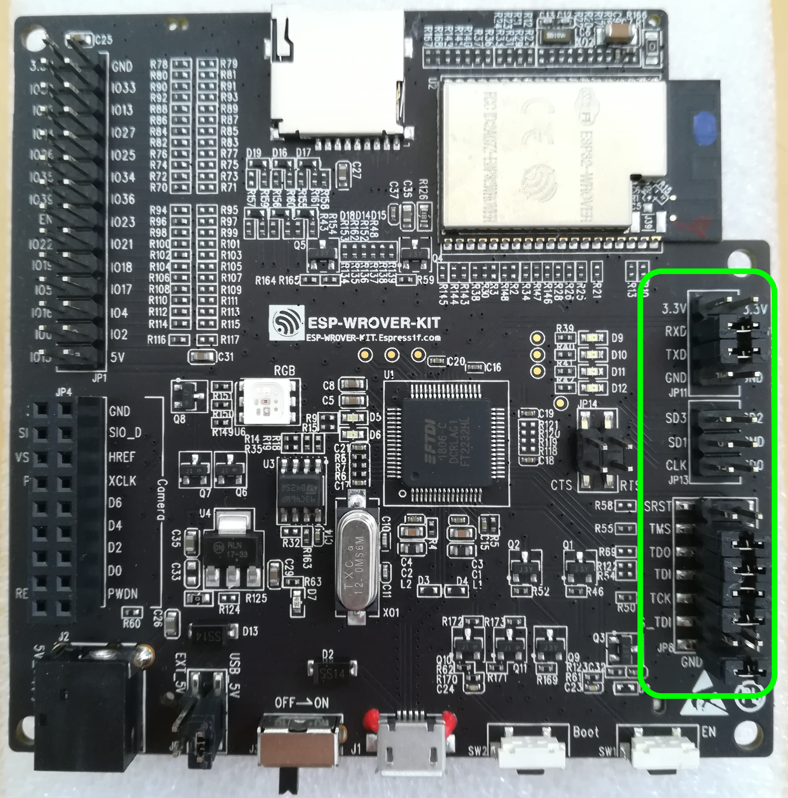

ESP32 Zephyr setup
##################

This tutorial shows you have to set up the ESP32 Wrover development board for use with zephyr on Linux.

First time board configuration
==============================

The first time the board is used you should set the correct jumper configuration for using JTAG. This only needs to be done once per board. See the figure for the correct jumper settings.

ESP32 Tools
===========

Follow steps 1, 2 and 3 from `espressif <https://docs.espressif.com/projects/esp-idf/en/latest/esp32/get-started/index.html>`_ to install the required tools, download the sdk, and install the ESP32 toolchain.

Zephyr Tools
============

Follow :ref:`these <zephyr-setup>` steps to download and set up zephyr and its build tools. Since `version 3.1.0`, Xtensa toolchain is included in the unified SDK.

Wifi and Bluetooth
==================

Proprietary Wi-Fi and Bluetooth binaries are no longer bundled in the core repository; they must be retrieved as binary blobs using the command:

.. code-block:: none

   west blobs fetch hal_espressif

Run this command just after the “Install the Zephyr SDK” step in the Getting Started Guide. 

Build and run
=============

In order to build and run Zephyr on the board use the following commands:

.. code-block:: none

   cd ~/zephyrproject/zephyr
   west build -b esp32_devkitc_wroom/esp32/procpu samples/hello_world
   west flash

If needed, also run

.. code-block:: none

	west packages pip --install

After the build succeeds, open the serial monitor with

.. code-block:: none

	west espressif monitor

Expected output:

.. code-block:: none

	***** Booting Zephyr OS vx.x.x-xxx-gxxxxxxxxxxxx *****
	Hello World! esp32_devkitc_wroom

