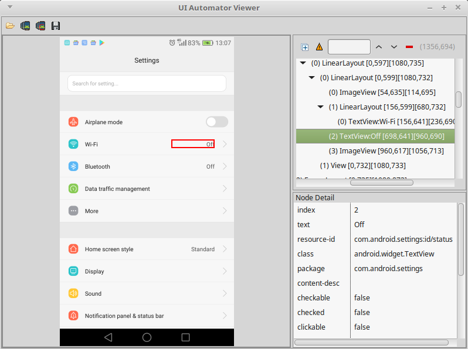

OS Test automation
====================

We in Amarula are working on various kinds of projects. But most of them comprise Android OS development. The development usually goes hand in hand with testing and test automation. There are tons of articles about android app test automation available on the internet, but only a few dealing with Android OS test automation. We are mainly using three types of frameworks that are sometimes integrated one to another. We always pay attention to careful identification of automatable scenarios. So we simplify our lives and not to make them harder blindly automating everything. In the following statement we will unveil the way to use them for OS Test Automation. Please note this article doesn’t mention Android Compatibility Test Suite that will be covered in a different article.
Bash/Batch scripting

Shell scripting is probably one of the most widely used technique among Linux/Android OS test developers. It is fast to program and run. It can be simply used for automation of manual steps done by using connection over USB debug bridge. Everytime you use the terminal (linux or android) for performing manual steps you can think of possible automation. But shell scripting has one big disadvantage, it gets complicated if you want to create test suites and do some advanced stuff around. You have to prepare everything by yourself.

We use shell scripting mostly for one time verification. When new build is ready, there is a shell script directly on the building server that verifies the content of update packages and signatures. Secondly we use shell scripts for load testing.
UiAutomator

UiAutomator is testing framework developed by Google. It is used for cross-app functional testing. People are usually more familiar with Espresso, but that one is only for a single app testing and requires test developer to have sources of the tested application. With UiAutomator it is possible to switch between applications and interact even with settings application without having any sources for the app. The main advantage of this framework is definitely the possibility to automate the ui interaction, but the disadvantage results from its purpose. When you try to automate the UI interaction you have to count with some delays and also some elements may not be loaded properly. This framework anyway should not replace the real user interaction with the device, it is just rather ment like a tool to automate some basic UI flow.

To start writing test cases in UiAutomator you will certainly use tool included in the SDK, called uiautomatorviewer. It helps to recognize UI elements present on the screen, that can be referenced in the code. It looks as shown on the following image.

The framework is based on Java and is well-suited for writing black box-style automated tests. The usage is really simple and the code should mimic manual steps like touch the button, swipe right and enter some text.

.. code-block:: Java

        Device.getInstance(getInstrumentation());
        UiObject2 obj = mDevice.findObject(By.text(label));
        obj.clickAndWaitForNewWindow();

After building the project there are two apk files generated - framework and application containing tests. You have to install them both on the device and run tests by executing following commands.

::

        instrumentation=$(adb -s "<device-ID>" shell pm list instrumentation \
         | grep "<package>" \
         | cut -d":" -f2 \
         | cut -d" " -f1)

        adb -s "<device-ID>" shell am instrument -w -e "<extra-key>" "<extra-value>" -e class "<package.test-class>" "$instrumentation"

jUnit

JUnit is unit testing framework for testing of java based applications. The base for testing of OS with this framework is again connection with device over USB debug bridge. Compared to bash scripts, jUnit allows developers to create test suites with common classes and use java library functions. It means you can directly start defining test cases and run them one after another, in suites or like parameterized. The jUnit automated tests help us integrate some tests written in bash and in uiautomator into one test stack.

We have developed additional classes build on jUnit, that help us the manipulation of the device, collecting the results and logs when the test scenario finishes with failed result. The following test setup allows us to test on multiple devices in parallel on linux host.

.. image:: diag_general_arch.png

JUnit framework is complex tool to ease the test development. It uses predefined annotations @Test, @Before, @After etc. The construct is simple as shown in the following code snippet. Instead of testing java code we are basically comparing the results from Android shell commands or logcat output from running test applications with expected results. For example we can verify that the number of users in the OS are equal to three. Each test has to be annotated with @Test. @Before annotates method that is executed before each test present in the class.

.. code-block:: Java

        public class Tests {
         @Before
         public void initialize() {
           //SETUP
         }

         @Test
         public void testScenario() {
           assertTrue(getUserCount(), 3, "The number of users in the OS is supposed to be 3");
         }

         @After
         Public void tearDown() {
           //TEAR DOWN
         }
        }

This framework also has construct called parameterized tests. Thanks to that you can run the same test with different parameters, without necessity of the code repetition. You define set of tests and it evaluates each iteration as a separate execution with its own test result. The usage is following.

.. code-block:: Java

        RunWith(Parameterized.class)
        public class ParameterizedTest{

         @Before
         public void initialSetup() {
           //DO SETUP
         }

         static final Object[][] TEST_SCENARIOS = new Object[][]{
             {"First parameter 1", "Second parameter 1"},
             {"First parameter 2", "Second parameter 2"}
         };

         private final String param1;
         private final String param2;

         public ParameterizedTest(String param1, String param2) {
           this.param1 = param1;
           this.param2 = param2;
         }

         @Parameters
         public static Collection<Object[]> configs() {
           return Arrays.asList(TEST_SCENARIOS);
         }

         @Test
         public void test() {
           System.out.println("Testing with param1(" + param1
             + ") & param2(" + param2 + ")"
           //TEST WITH ASSERTION
         }
        }

Android applications

The last approach we use are Android applications. The main advantage is the access to the device. You can run other applications, launch intents and initiate connection with instant application response. You don’t have to parse the output from the logcat but just get the response for the action directly. The biggest disadvantage of this approach is the fact your tests are located on the tested device. It can be a bit tricky to base your tests on the device you are testing. If there is any bug in the device your tests might not work as you expect. The device may reboot unexpectedly and you will get to the undefined state. Also execution and report gathering gets a bit more complicated that way.

We usually use this approach to create semi-automated tests. That means we create simple applications that have to be executed from outside and someone has to evaluate the output. The executions and evaluation can easily be done by jUnit tests or shell scripts. In that case you will get the best of both worlds. Or they can be simply incorporated to the manual tests to simplify their execution.

Conclusion

Android OS test automation is specific field of automation. It differs from automation of web or mobile application. We are mostly concerned about system security for which we use the test automation the most. Verifications that it is possible to send intents between specific domains, the files have correct labels, etc. For such purpose the automation is probably the only way.

Each of presented approaches has it’s advantages and disadvantages. But the best way to handle the automation is to take the best of all options.
