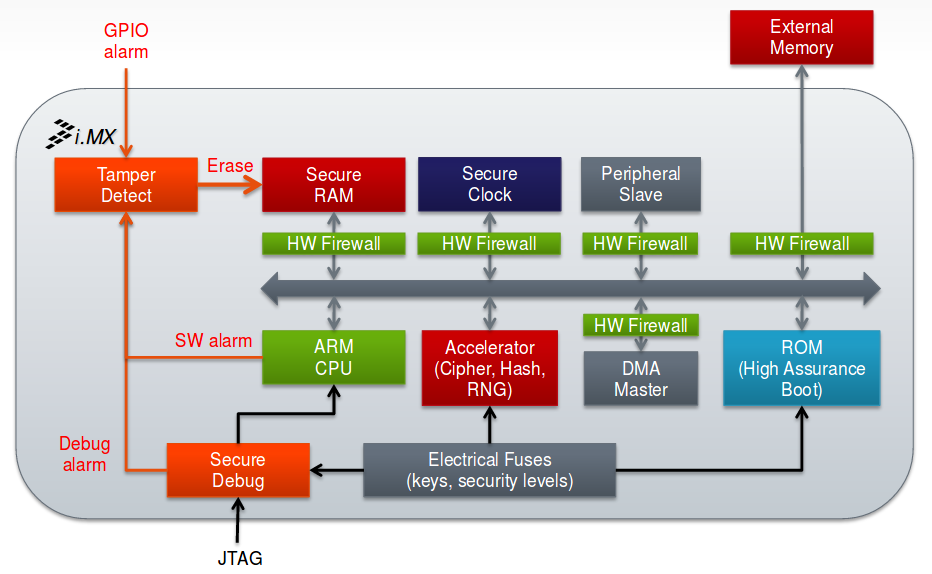
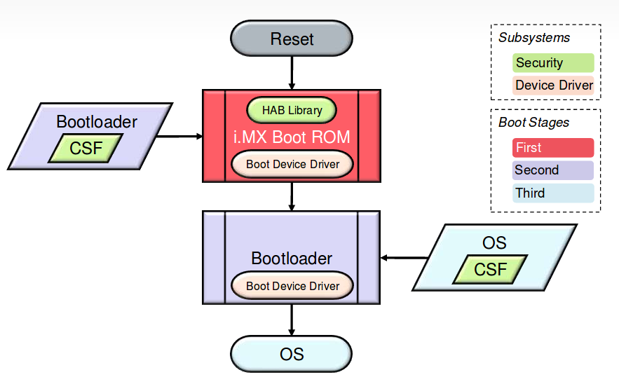
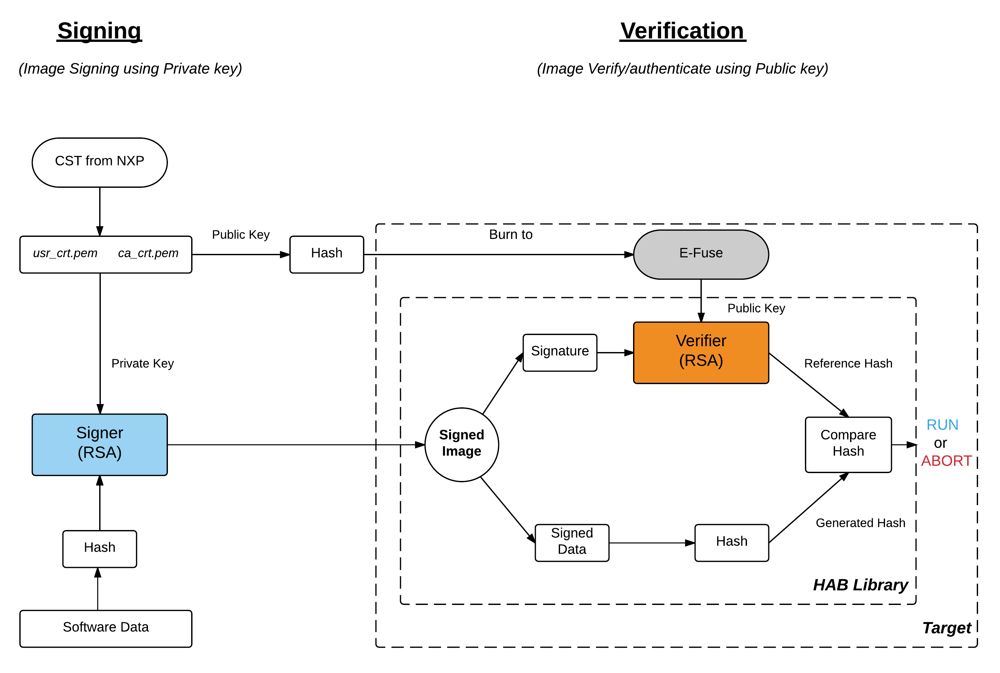
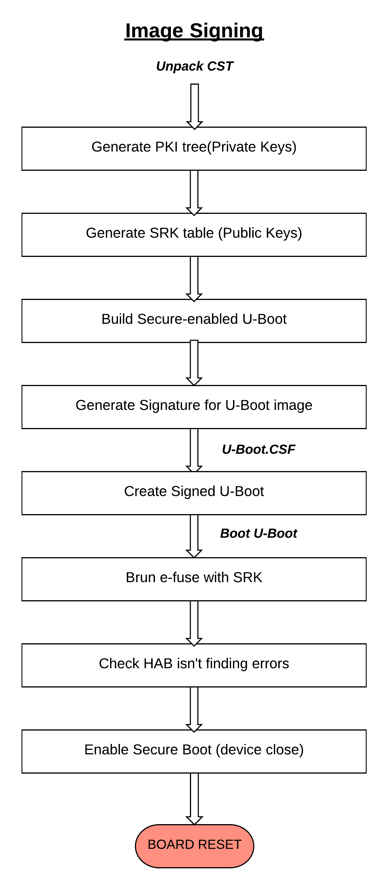
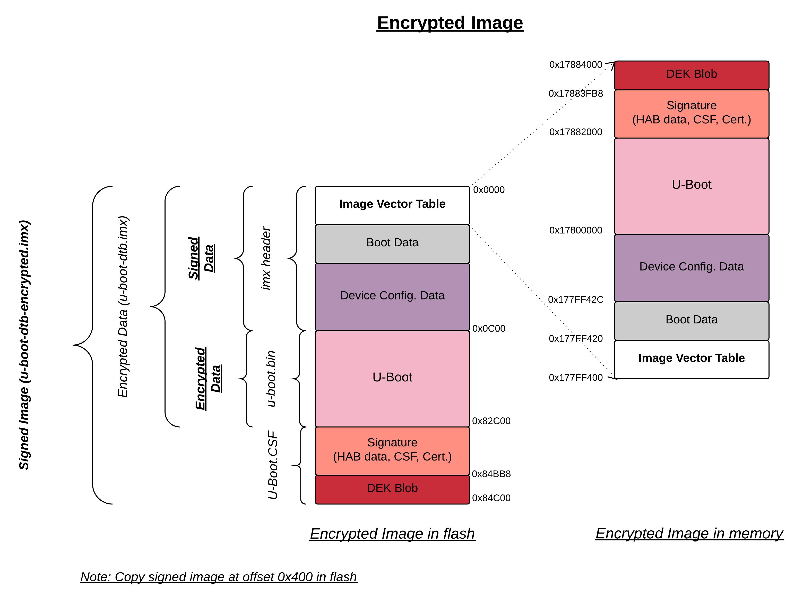
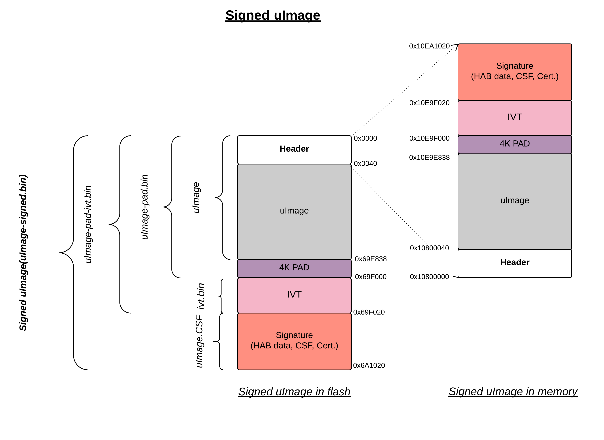

i.MX6 HABv4
===========

About this

This tutorial describe the information and usage about i.MX Secure Architecture.

i.MX Security

Verify the loaded software to ensure that it is authorized during runtime is usually 
termed as Verified or Secure or Trusted system mechanism.

i.MX Trust Architecture - Overview

Below are the threats that are identified and processed with trusted architecture.

Malware:

 - Rootkits, trojans, viruses, worms, keyloggers, bots

 - Risk enhanced by rich & open OS

 - Countermeasures: trusted execution, high assurance boot

Hacking

 - Reverse engineering, brute force

 - Countermeasures: secure storage, secure debug, encryption

Physical attack

 - Bus snooping, glitching,

 - Countermeasures: secure storage, tamper detection

i.MX Trust Architecture - Features

Trusted Execution:

    TrustZone Secure & Normal Worlds (processor modes)

    Isolates execution of critical SW from possible malware

    Hardware firewalls between CPU & DMA masters and memory & peripherals

High Assurance Boot:

    Authenticate/Signed boot: prevent unauthorized software execution

    Encrypted boot: protects software confidentiality

    Signature checks embedded in on-chip boot ROM

    Run every time processor reset

Cryptographic Accelerators:

    i.MX family dependent

    Symmetric: AES-128, AES-256, 3DES, ARC4

    Message Digest & HMAC: SHA-1, SHA-256, MD-5

Secure Storage:

    Protects data confidentiality and integrity

    HW-only keys: no SW access

    Off-chip: cryptographic protection including device binding

    On-chip: self-clearing Secure RAM (CAAM)

HW Random Number Generation:

    Ensures strong keys and protects against protocol replay

    On-chip entropy generation

    Cryptographically secure deterministic RNG (NIST compliant)

SNVS Secure Clock:

    Provides reliable time source

    On-chip, separately-powered real-time clock

    Protection from SW tampering

Secure Debug:

    Three security levels + complete JTAG disable

    Protects against HW debug (JTAG) exploitation for Security circumvention and Reverse engineering

Tamper Detection:

    Protects against run-time tampering

    Monitoring of various alarm sources

        Debug activation

        External alarm (e.g. cover seal)

        SW integrity checks

        SW alarm flags

High Assurance Boot (HAB)

Below are the recommend acronyms related to this tutorial.

Boot ROM: Small piece of one-time programmable firmware written in on-chip read-only memory location
and the very first unsigned-software which is executed by the processor on power-on or reset.

Secure Boot ROM: Similar to Boot ROM, but capable of running signed-software using secure libraries.

HAB Library: Secure software library executed in i.MX Boot ROM, using Signing and Encryption processes.

Signed Software/Image: Software Image further padded or processed using Signature that can capable
to run only on secure environment.

Signature: Legally binding secure attributes to Signed Image, these attributes can be Private/Public keys,
HAB data, Certificate, Secrete keys etc which is understandable by the HAB.

CSF: Command Sequence File, a binary data structure interpreted by the HAB to guide
signing and/or decryption process.

CST: Code Signing Tool, like OpenSSL an application running on a build host to generate PKI tree, SRK table
along with associated CSF file.

PKI tree: Public Key Infrastructure, a hierarchy of public key certificates in which each certificate
(except the root certificate) can be verified using the public key above it.

RSA: Public key cryptography algorithm used for Signing or Authentication process.

SRK: Super Root Key, an RSA key pair which forms the start of the boot time authentication  chain.
The hash of the SRK public key is embedded in the processor using OTP hardware(e-fuse).
The SRK private key is held by the Signature generation for software image.

DEK: Data Encryption Key (DEK), is the key that will be used to actually encrypt the image.

DEK Blob: Encryption of DEK using OTPMK with the help of CAAM HW

OTPMK: AES-256 key burned to fuses by NXP before the IC is shipped. This is unique per chip and only CAAM can access the key.

Secret Key: Generally an outcome key of DEK Blob key used to encrypt and decrypt.

AES: Advanced Encryption Standard used for Encryption process

HAB Secure Boot chain 

Upon reset i.MX Boot ROM reads the efuse to determine the security configuration of the SoC and
the type of the boot device.

The ROM then loads the bootloader image(signed-image) to DDR memory.
The image contains both the bootloader itself and signature data and public key certificate data which
are collectively called CSF data.

Once the bootloader is loaded, execution is then passed to the HAB library which will verify
the signatures of the bootloader stage.

If signature verification fails, execution is not allowed to leave the ROM for securely configured SoCs, also called “closed” devices

If signature verification pass, execution is allowed to leave the ROM for securely configured SoCs, also called “open” devices
HAB Overview

- HAB support Signing and Encryption process, where later one change the software-data into 
  unreadable random gibberish using secrete key.
- HABv4 is the version supported by i.MX6
- HAB interfaces with SNVS and CAAM secure boot components.
- CAAM accelerate SHA-256 operation during signature verification and
  AES-128 operation during decryption boot operation.
- HAB support X.509 Public key certificate, in CMS signature format. 

HAB - Signed Boot
Signed Boot Flow

During Signing, host need to generate PKI tree, Super Root Keys, or SRK, are components of the PKI tree,
then the table of public SRK should burn to E-Fuse and finally signed image can be generated using 
table of public SRK plus private SRKs by defining them in a format of CSF.

During Verification, HAB evaluates the SRK table included in the signature by hashing it and comparing 
the result to the SRK fuse values.

If the SRK verification is successful, this establishes the root of trust, and the remainder of the signature can be processed to authenticate the image.
Image Signer Flow

Signed Boot - Usage
Signed Image Format (U-Boot)

.. image:: format-signed-image.png

The below procedure will describe an example on how signed boot has been done with Engicam i.CoreM6 Quad board.

Download cryptographic tool

::

        $ tar xvf cst-2.3.2.tar.gz
        $ cd cst-2.3.2/keys

Generate PKI tree (Private keys)

serial - 8-digit OpenSSL uses the contents of this file for the certificate serial numbers.

key_pass.txt - Contains your pass phrase that will protect the HAB code signing private keys.

::

        $ echo "42424242" > serial
        $ echo "Amarual357" > key_pass.txt

        $ echo "Amarual357" >> key_pass.txt
        $ ./hab4_pki_tree.sh

            +++++++++++++++++++++++++++++++++++++++++++++++++++++++++++++++

            This script is a part of the Code signing tools for Freescale's

            High Assurance Boot.  It generates a basic PKI tree.  The PKI

            tree consists of one or more Super Root Keys (SRK), with each

            SRK having two subordinate keys:

                + a Command Sequence File (CSF) key

                + Image key.

            Additional keys can be added to the PKI tree but a separate

            script is available for this.  This this script assumes openssl

            is installed on your system and is included in your search

            path.  Finally, the private keys generated are password

            protectedwith the password provided by the file key_pass.txt.

            The format of the file is the password repeated twice:

                my_password

                my_password

            All private keys in the PKI tree are in PKCS #8 format will be

            protected by the same password.

            +++++++++++++++++++++++++++++++++++++++++++++++++++++++++++++++

        Do you want to use an existing CA key (y/n)?: n

        Do you want to use Elliptic Curve Cryptography (y/n)?: n

        Enter key length in bits for PKI tree: 2048

        Enter PKI tree duration (years): 10

        How many Super Root Keys should be generated? 4

        Do you want the SRK certificates to have the CA flag set? (y/n)?: y

Private keys will generate on keys directory and corresponding Certificates are placed in the crts directory.

Generate SRK table (Public keys)

::

        $ cd ../crts

        $ ../linux64/srktool \

        > -h 4 \

        > -t SRK_1_2_3_4_table.bin \

        > -e SRK_1_2_3_4_fuse.bin \

        > -d sha256 \

        > -c ./SRK1_sha256_2048_65537_v3_ca_crt.pem,\

        > ./SRK2_sha256_2048_65537_v3_ca_crt.pem,\

        > ./SRK3_sha256_2048_65537_v3_ca_crt.pem,\

        > ./SRK4_sha256_2048_65537_v3_ca_crt.pem \

        > -f 1

SRK_1_2_3_4_table.bin - SRK table contents with HAB data
SRK_1_2_3_4_fuse.bin - contains SHA256 result to be burned to fuse

Build Secure-enabled U-Boot

::

        u-boot> git clone https://github.com/openedev/u-boot-amarula.git -b hab

        u-boot> make imx6q_icore_mmc_defconfigu-boot> make
        u-boot> cat u-boot-dtb.imx.log

        Image Type:   Freescale IMX Boot Image

        Image Ver:    2 (i.MX53/6/7 compatible)

        Mode:         DCD

        Data Size:    536576 Bytes = 524.00 KiB = 0.51 MiB

        Load Address: 177ff420

        Entry Point:  17800000

        HAB Blocks:   177ff400 00000000 00082c00

        DCD Blocks:   00910000 0000002c 00000328

Generate Signature for U-Boot Image

::

        $ cd ~/cst-2.3.2/linux64
        $ cat U-Boot.CST

        [Header]

        Version = 4.1

        Security Configuration = Open

        Hash Algorithm = sha256

        Engine Configuration = 0

        Certificate Format = X509

        Signature Format = CMS

        Engine = CAAM

        [Install SRK]

        File = "../crts/SRK_1_2_3_4_table.bin"

        Source index = 0

        [Install CSFK]

        File = "../crts/CSF1_1_sha256_4096_65537_v3_usr_crt.pem"

        [Authenticate CSF]

        [Install Key]

        # Key slot index used to authenticate the key to be installed

        Verification index = 0

        # Key to install

        Target index = 2

        File = "../crts/IMG1_1_sha256_4096_65537_v3_usr_crt.pem"

        [Authenticate Data]

        Verification index = 2

        Blocks = 0x177ff400 0x0 0x82c00 "u-boot-dtb.imx"

        $ cp u-boot/u-boot-dtb.imx .
        $ ./cst --o U-Boot_CSF.bin --i U-Boot.CSF

        CSF Processed successfully and signed data available in U-Boot_CSF.bin

Create Signed U-Boot

::

        $ objcopy -I binary -O binary --pad-to 0x2000 --gap-fill=0x00 U-Boot_CSF.bin U-Boot_CSF_pad.bin
        $ cat u-boot-dtb.imx U-Boot_CSF_pad.bin > u-boot-dtb-signed.imx
        $ dd if=u-boot-dtb-signed.imx of=/dev/sda bs=1K seek=1 && sync

<< Put SD card and power-on the board >>

Burn e-fuse with SRK

::

        efuse dump

        $ cd ../crts

        $ hexdump -e '/4 "0x"' -e '/4 "%X""\n"' < SRK_1_2_3_4_fuse.bin

        0x67C7506F

        0x7D51EFD0

        0x9E450811

        0x74ED8483

        0xB774A2A

        0xD33FF045

        0x3343F187

        0xC86DDA92

::

        Burn on efuse

        U-Boot 2017.05-rc2-00058-g7d6c4ef (Apr 25 2017 - 11:30:36 +0530)

        CPU:   Freescale i.MX6Q rev1.2 at 792MHz

        CPU:   Industrial temperature grade (-40C to 105C) at 53C

        Reset cause: POR

        Model: Engicam i.CoreM6 Quad/Dual Starter Kit

        DRAM:  2 GiB

        MMC:   FSL_SDHC: 0

        *** Warning - bad CRC, using default environment

        No panel detected: default to Amp-WD

        Display: Amp-WD (800x480)

        In:    serial

        Out:   serial

        Err:   serial

        switch to partitions #0, OK

        mmc0 is current device

        Net:   

        Error: ethernet@02188000 address not set.

        No ethernet found.

        Hit any key to stop autoboot:  0
        icorem6qdl> fuse prog -y 3 0 0x67C7506F

        Programming bank 3 word 0x00000000 to 0x67c7506f...

        icorem6qdl> fuse prog -y 3 1 0x7D51EFD0

        Programming bank 3 word 0x00000001 to 0x7d51efd0...

        icorem6qdl> fuse prog -y 3 2 0x9E450811

        Programming bank 3 word 0x00000002 to 0x9e450811...

        icorem6qdl> fuse prog -y 3 3 0x74ED8483

        Programming bank 3 word 0x00000003 to 0x74ed8483...

        icorem6qdl> fuse prog -y 3 4 0xB774A2A

        Programming bank 3 word 0x00000004 to 0x0b774a2a...

        icorem6qdl> fuse prog -y 3 5 0xD33FF045

        Programming bank 3 word 0x00000005 to 0xd33ff045...

        icorem6qdl> fuse prog -y 3 6 0x3343F187

        Programming bank 3 word 0x00000006 to 0x3343f187...

        icorem6qdl> fuse prog -y 3 7 0xC86DDA92

        Programming bank 3 word 0x00000007 to 0xc86dda92...

Check HAB isn't finding ERRORS?

::

        icorem6qdl> hab_status

        Secure boot disabled

        HAB Configuration: 0xf0, HAB State: 0x66

        No HAB Events Found!

HAB authentication works fine, and the hab_status show 'No HAB Events Found!' 
So the device is open now try to close for enabling Secure boot

Enable Secure boot

Be careful with this step and if you're sure with all steps above and 
hab_status should show 'No HAB Events Found!'
Once this setup executed, chip will only boot an image signed with the keys that match the SRK blown fuses.

::

        icorem6qdl> fuse prog 0 6 0x2

        Programming bank 0 word 0x00000006 to 0x00000002...

        Warning: Programming fuses is an irreversible operation!

                 This may brick your system.

                 Use this command only if you are sure of what you are doing!

        Really perform this fuse programming? <y/N>

        y

        icorem6qdl> reset

        resetting ...

        U-Boot 2017.05-rc2-00058-g5c41464-dirty (Apr 25 2017 - 13:11:59 +0530)

        CPU:   Freescale i.MX6Q rev1.2 at 792MHz

        CPU:   Industrial temperature grade (-40C to 105C) at 49C

        Reset cause: WDOG

        Model: Engicam i.CoreM6 Quad/Dual Starter Kit

        DRAM:  2 GiB

        MMC:   FSL_SDHC: 0

        *** Warning - bad CRC, using default environment

        No panel detected: default to Amp-WD

        Display: Amp-WD (800x480)

        In:    serial

        Out:   serial

        Err:   serial

        switch to partitions #0, OK

        mmc0 is current device

        Net:   

        Error: ethernet@02188000 address not set.

        No ethernet found.

        Hit any key to stop autoboot:  0

        icorem6qdl> hab_

          hab_auth_img hab_status

        icorem6qdl> hab_status

        Secure boot enabled

        HAB Configuration: 0xcc, HAB State: 0x99

        No HAB Events Found!

HAB - Encrypted boot
Encrypted Boot Flow

.. image:: hab-encrypt.png

During Encryption, host need to follow similar steps as Signing process for 'Header' of Software Data.
then the table of public SRK should burn to E-Fuse and finally payload cab be encrypted using
table of public SRK, private SRKs, and DEK_blob(secret key) by defining them in a format of CSF.

DEK(dek.bin) is generated by cst_encrypt during encryption process but

The problem then is how do we protect the DEK since it is required on the IC to decrypt the image at boot time? The solution is to create a DEK blob.

How to generate DEK_blob? Target will encrypt the DEK using OTPMK from CAAM.

During Decryption, First HAB evaluates the SRK table included in the signature by hashing it and comparing 
the result to the SRK fuse values like Verification process and HAB evaluates secrete key by decrypt the
DEK_blob using OTPMK and encrypted payload is further decrypt using secrete key ie generated before.

Image Encrypt Flow

.. image:: Image_Encrypt.png

Encrypted boot - Usage
Encrypted Image Format (U-Boot)

The below procedure will describe an example on how encrypted boot has been done with Engicam i.CoreM6 Quad board.

See the same steps in Signed Boot - Usage PKI tree, SRK table and E-fuse burn.
Generate Signature for U-Boot Image

CST from NXP doesn't allow to use encryption, so you need to build a new binary

::

        $ cd ~/cst-2.3.2/code/back_end/src
        $ gcc -o cst_encrypt -I ../hdr -L ../../../linux64/lib *.c -lfrontend -lcrypto
        $ cp cst_encrypt ../../../linux64/

::

        $ cd ~/cst-2.3.2/linux64
        $ cat U-Boot.CST

        [Header]

        Version = 4.1

        Hash Algorithm = SHA256

        Engine Configuration = 0

        Certificate Format = X509

        Signature Format = CMS

        Engine = CAAM

        [Install SRK]

        File = "../../crts/SRK_1_2_3_4_table.bin"

        Source index = 0

        [Install CSFK]

        File = "../../crts/CSF1_1_sha256_2048_65537_v3_usr_crt.pem"

        [Authenticate CSF]

        [Unlock]

        Engine = CAAM

        Features = RNG

        [Install Key]

        # Key slot index used to authenticate the key to be installed

        Verification index = 0

        # Key to install

        Target index = 2

        File = "../../crts/IMG1_1_sha256_2048_65537_v3_usr_crt.pem"

        [Authenticate Data]

        Verification index = 2

        Blocks = 0x177ff400 0x0 0xC00 "u-boot-dtb.imx"

        #Encrypt the boot image and create a DEK

        [Install Secret Key]

        Verification Index = 0

        Target Index = 0

        Key = "dek.bin"

        Key Length = 128

        Blob Address = 0x17883FB8

        #Provide DEK blob location to decrypt

        [Decrypt Data]

        Verification Index = 0

        Mac Bytes = 16

        Blocks = 0x17800000 0x00000C00 0x82000 "u-boot-dtb.imx"

        $ cp u-boot/u-boot-dtb.imx .
        $ ./cst_encrypt --o U-Boot_CSF.bin --i U-Boot.CSF

        CSF Processed successfully and signed data available in U-Boot_CSF.bin

Create DEK_blob

Once dek.bin generated by cst_encrypt need to protect the dek.bin by creating DEK_blob.bin at target

::

        icorem6qdl>

        fatload mmc 0:1 0x10800000 dek.bin

        reading dek.bin

        16 bytes read in 11 ms (1000 Bytes/s)

        icorem6qdl> dek_blob 0x10800000 0x10801000 128

        SEC0: RNG instantiated

        Encapsulating provided DEK to form blob

        DEK Blob

        8100484166551000307CB52A999D6D9191D4D7C479DE7DF60A13C0EA7D9ACF92D9491CEA82B91C6F194EC134D9B63005
        36F20FFD063C8700F4513BE57F7C7BE43E038C1133138757

        icorem6qdl> fatwrite mmc 0 0x10801000 DEK_blob.bin 0x48

        writing DEK_blob.bin

        72 bytes written

Create Encrypted U-Boot

::

        $ objcopy -I binary -O binary --pad-to=0x1FB8 --gap-fill=0x00 U-Boot_CSF.bin U-Boot_CSF_pad.bin
        $ cat cat u-boot-dtb.imx U-Boot_CSF_pad.bin DEK_blob.bin > u-boot-dtb-encrypte.imx
        $ dd if=u-boot-dtb-encrypted.imx of=/dev/sda bs=1K seek=1 && sync

HAB - Signed uImage

Now that your bootloader image is properly authenticated/encrypted and that your device is secured, you can sign 
your kernel image so U-Boot ensures to load a known version.

Here are the details of Signing uImage from linux-next. 

Signed uImage Format

See uImage format, which built from linux-next tree

::

        $ mkimage -l uImage

        Image Name:   Linux-4.11.0-next-20170510

        Created:      Wed May 10 21:27:58 2017

        Image Type:   ARM Linux Kernel Image (uncompressed)

        Data Size:    6940664 Bytes = 6777.99 kB = 6.62 MB

        Load Address: 10008000

See the same uImage is fitting on memory after proper signed, just numerical understanding nevertheless 
same procedure as with "HAB - Signed Boot"

Signed uImage Creation

Use the same PKI tree and SRK keys that been tested with U-Boot and proceed with "Image Signer Flow" of U-Boot
except the numerical difference, nevertheless the same procedure.

4K PAD

Since Linux follows 4K pagesize format for Image process, So pad the built uImage to nearest 4K padding. 
here the actual uImage size is 0x69E838 after nearest 4K padding it becomes 0x69F000.

::

        $ objcopy -I binary -O binary --pad-to=0x69F000 --gap-fill=0x00 uImage uImage-pad.bin

Generate IVT

By default imx header attach the IVT for U-Boot (u-boot-dtb.imx), but Linux we need to explicitly attach the
IVT based on the perl script as below.

    Size of the IVT is 0x20 bytes

    Self pointer size is the uImage size once padded to 4K

    CSF pointer size is Self pointer + 0x20

::

        $ cat genIVT

        #! /usr/bin/perl -w

        use strict;

        open(my $out, '>:raw', 'ivt.bin') or die "Unable to open: $!";

        print $out pack("V", 0x412000D1); # IVT Header

        print $out pack("V", 0x10801000); # Jump Location

        print $out pack("V", 0x0); # Reserved

        print $out pack("V", 0x0); # DCD pointer

        print $out pack("V", 0x0); # Boot Data

        print $out pack("V", 0x10E9F000); # Self Pointer

        print $out pack("V", 0x10E9F020); # CSF Pointer

        print $out pack("V", 0x0); # Reserved

        close($out);

Create IVT uImage

Build the genIVT that should create ivt.bin

::

        $ perl genIVT

Attach ivt.bin to padded uImage

::

        $ cat uImage-pad.bin ivt.bin > uImage-pad-ivt.bin

Create CSF uImage

Create uImage.CSF file and build the binary.

::

        $ cat uImage.CSF

        [Header]

        Version = 4.1

        Security Configuration = Open

        Hash Algorithm = sha256

        Engine Configuration = 0

        Certificate Format = X509

        Signature Format = CMS

        Engine = CAAM

        [Install SRK]

        File = "../../crts/SRK_1_2_3_4_table.bin"

        Source index = 0

        [Install CSFK]

        File = "../../crts/CSF1_1_sha256_2048_65537_v3_usr_crt.pem"

        [Authenticate CSF]

        [Install Key]

        # Key slot index used to authenticate the key to be installed

        Verification index = 0

        # Key to install

        Target index = 2

        File = "../../crts/IMG1_1_sha256_2048_65537_v3_usr_crt.pem"

        [Authenticate Data]

        Verification index = 2

        Blocks = 0x10800000 0x0 0x69F020 "uImage-pad-ivt.bin"
        $ ./cst --o uImage_CSF.bin --i uImage.CSF

        CSF Processed successfully and signed data available in uImage_CSF.bin

Attach uImage_CSF.bin with padded ivt uImage

::

        $ cat uImage-pad-ivt.bin uImage_CSF.bin > uImage-pad-ivt-csf.bin

Create Signed uImage

::
        
        $ objcopy -I binary -O binary --pad-to=0x6A1020 --gap-fill=0x00 uImage-pad-ivt-csf.bin uImage-signed.bin

That’s it, you can now modify your U-Boot bootcmd so it includes the HAB command that checks the kernel,

Signed uImage CHECK??

::

        icorem6qdl> fatload mmc 0:1 0x10800000 uImage-signed.bin

        reading uImage-signed.bin

        6950944 bytes read in 351 ms (18.9 MiB/s)

        icorem6qdl> hab_auth_img 0x10800000 0x69F000

        Authenticate image from DDR location 0x10800000...

        Secure boot enabled

        HAB Configuration: 0xcc, HAB State: 0x99

        No HAB Events Found!
